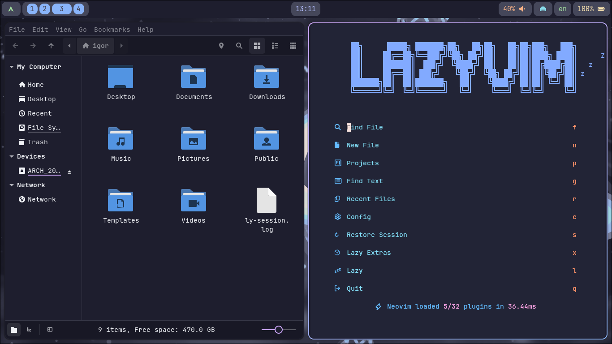
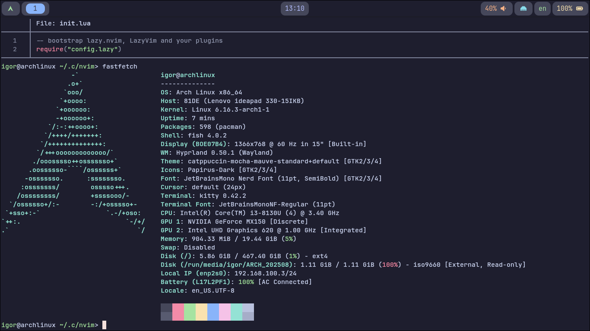

# ArchRocket




ArchRocket is a minimalistic, Catppuccin-themed, plug-and-play Arch Linux post-installation script.
Originally created for personal use, now shared on GitHub.

## Features

- Installs essential packages: Hyprland, Ly login manager, Fish, Engrampa, and more.
- Sets up user environment: standard directories (`Downloads`, `Pictures`, `Videos`, etc.).
- Configures GTK and icon themes (Catppuccin + Papirus-Dark).
- Applies user-friendly keybindings and Hyprland window rules.

## Installation

Before running ArchRocket, it is expected that fn audio server (like **PipeWire** or **PulseAudio**) is already set up.

Clone the repository and run the script as root:

```bash
git clone https://github.com/Gigores/ArchRocket.git
cd install
sudo bash install.sh
```
